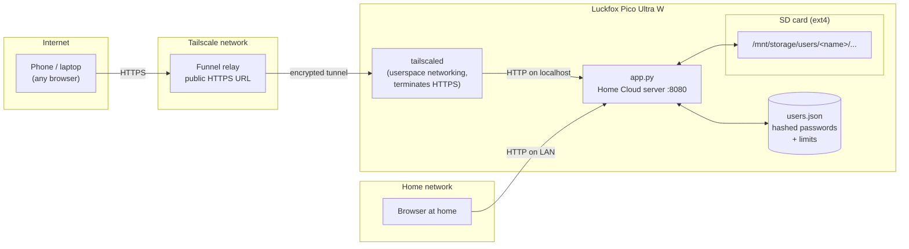
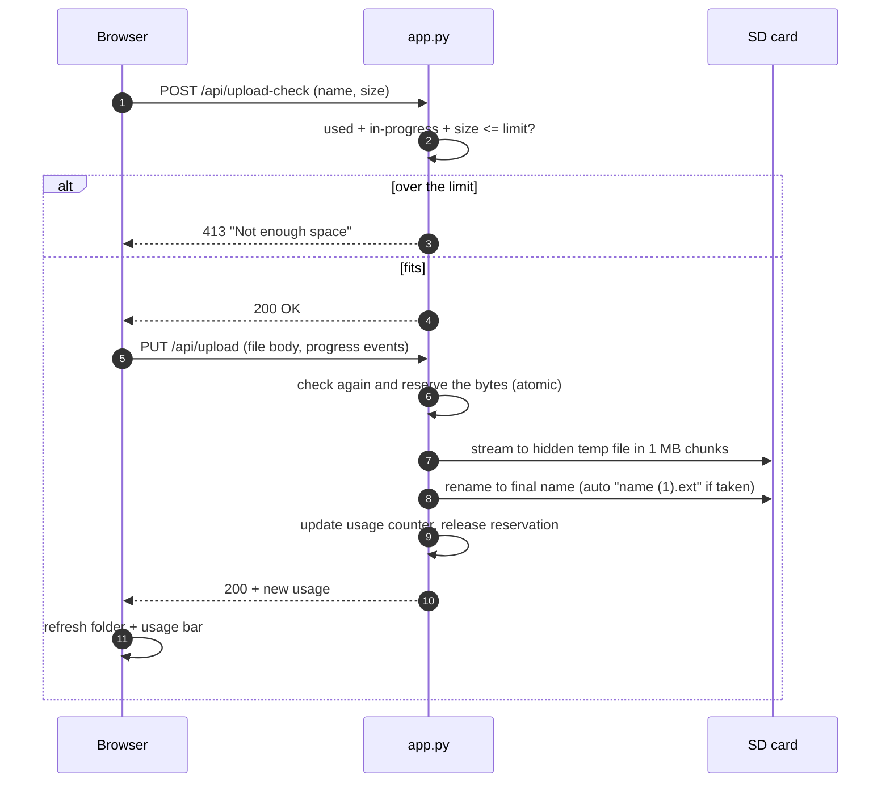
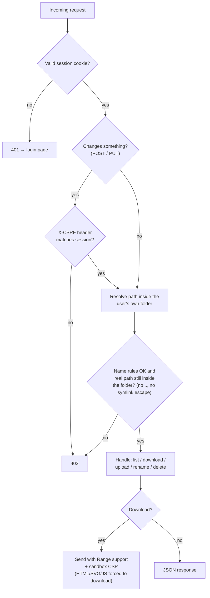
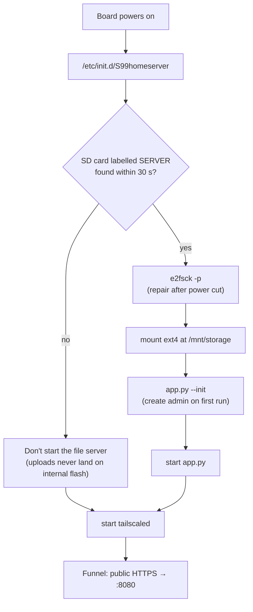

# Home Cloud

A small personal cloud, like a self-hosted Google Drive, running on a **Luckfox Pico Ultra W**, a thumb-sized Linux board with a single 1.2 GHz ARM core and 256 MB of RAM. It serves files from an SD card to a clean web app you can open from anywhere, with per-user accounts and storage limits.

- **Files:** upload with progress, drag and drop files or whole folders, folders, rename, delete, multi-select, search, and list or grid view
- **Previews:** photos (with next/previous), video, music, PDF and text files, all inside the page
- **Users:** each person gets a private folder and can only see their own files
- **Storage limits per user:** set by the admin, enforced on every upload
- **Admin page:** storage overview, add or remove users, set limits, reset passwords
- **Access from anywhere:** public HTTPS link through Tailscale Funnel, with no port forwarding on the router
- **Tiny footprint:** one Python file using only the standard library, plus a plain HTML/CSS/JS frontend. No frameworks, no database, no build step.

---

## How it works

### The big picture



The router has no open ports. The board makes an **outgoing** connection to Tailscale, and Tailscale Funnel sends public HTTPS traffic back through that connection. Tailscale also issues the HTTPS certificate automatically.

### What happens on an upload

Storage limits are enforced by the server itself, so there's no way to get around them from the browser:



- **Reservations** stop two uploads running at the same time from both squeezing in under the limit.
- **Temp file, then rename**: an interrupted upload never leaves a half-written file behind.
- **Usage** is counted once at start-up, then kept up to date on every upload and delete, so the slow CPU never re-scans the card.

### What happens on every request



### Boot sequence



---

## Security

| What | How |
|---|---|
| Passwords | PBKDF2-SHA256, 100,000 rounds, random salt per user. Never stored in plain text. |
| Sessions | Random 256-bit token in an `HttpOnly`, `SameSite=Strict` cookie; 7-day expiry. Changing or resetting a password logs out that user's other sessions. |
| CSRF | Every state-changing request needs an `X-CSRF` header tied to the session. |
| Password guessing | 5 wrong logins from one IP means a 15-minute lockout. Uses the real client IP behind the Funnel proxy. |
| Isolation | Every path is checked part by part (no `..`, no hidden names), then resolved with `realpath` and must stay inside the user's folder. Symlinks can't escape. |
| Uploaded content | Files are served with `Content-Security-Policy: sandbox` and `nosniff`. HTML, SVG, XML and JS files are always downloaded, never rendered, so an uploaded page can't run scripts on the site. |
| App pages | Strict CSP (`script-src 'self'`, no inline scripts), `X-Frame-Options: DENY`. The frontend builds the DOM with `textContent`, never `innerHTML` with user data. |
| Admin | Only the `admin` account can reach `/api/admin/*`. User folders can't be deleted from the file view. Removing a user **moves** their files to `removed-users/` rather than deleting them. |
| Board | Telnet, Samba and network ADB (all open by default on the stock image) are disabled; SSH is key-only. |

The test suite I used during development covers login, CSRF, limits, isolation, path traversal (`..`, `%2e%2e`, absolute paths, symlinks), risky file types and brute-force lockout.

---

## Hardware and OS notes

| | |
|---|---|
| Board | Luckfox Pico Ultra W (Rockchip RV1106, Cortex-A7 @ 1.2 GHz, 256 MB RAM, 8 GB eMMC, Wi-Fi 6, 100 Mb Ethernet) |
| OS | Luckfox's stock Buildroot image (uClibc, BusyBox, Python 3.11) |
| Storage | microSD card in a USB card reader, through a USB-C hub |

Getting there took a few board-specific steps:

1. **USB host mode.** The USB-C port ships in device (gadget) mode, so it can't read drives. `luckfox-config`'s `luckfox_usb_app host` function applies a device-tree overlay that sets `dr_mode = "host"`, which takes effect after a reboot.
2. **MBR, not GPT.** The kernel is built without GPT support, so the card uses an MBR partition table and one ext4 partition labelled `SERVER` (see `tools/format-card.sh`).
3. **Tailscale in userspace mode.** The kernel has no `/dev/net/tun`, so `tailscaled` runs with `--tun=userspace-networking`. Incoming Funnel traffic still reaches local ports.
4. **CA certificates.** The image ships without a trusted CA bundle, so Tailscale couldn't fetch its Let's Encrypt certificate. Installing Mozilla's `cacert.pem` as `/etc/ssl/certs/ca-certificates.crt` fixed it.
5. **No SQLite, uClibc.** Off-the-shelf servers that need SQLite or glibc builds don't fit, which is why the server uses only the Python standard library and keeps state in a small JSON file.

---

## Project layout

```
app.py              the whole server: auth, files API, uploads, downloads, admin API
web/
  index.html        page shell
  app.css           styles (light + dark, responsive)
  app.js            single-page app: login, file browser, uploads, viewer, admin
  favicon.svg
S99homeserver       init script: mount card, start app + tailscaled on boot
deploy.ps1          copy the app to the board over SSH (converts line endings)
tools/
  format-card.sh    one-time: wipe a card and create one ext4 "SERVER" partition
```

### API

| Method | Path | Purpose |
|---|---|---|
| POST | `/api/login`, `/api/logout` | start / end a session |
| GET | `/api/me` | current user, usage, limit |
| GET | `/api/list?path=` | folder contents |
| POST | `/api/mkdir`, `/api/rename`, `/api/delete` | folder and file operations |
| POST | `/api/upload-check` | will this file fit? |
| PUT | `/api/upload?path=&rel=&name=` | upload (raw body, streamed to disk) |
| GET | `/d/<path>` | download or stream (Range supported; `?dl=1` forces download) |
| POST | `/api/password` | change your own password |
| GET | `/api/admin/overview` | disk + per-user usage (admin) |
| POST | `/api/admin/users` | add / set limit / reset password / remove (admin) |

---

## Setting it up on your own board

1. Flash Luckfox's Buildroot image, connect the board to your network, and set up key-based SSH.
2. Switch the USB-C port to host mode (`luckfox-config` → Advanced → USB → host) and reboot.
3. Plug in the card reader and prepare the card. **This erases the card:**
   `sh tools/format-card.sh` (asks you to type `YES`)
4. Copy the app to `/opt/homeserver/`: `app.py`, `web/`, and `S99homeserver` → `/etc/init.d/S99homeserver`.
5. Install the Tailscale static ARM build into `/opt/homeserver/`, and put a CA bundle at `/etc/ssl/certs/ca-certificates.crt`.
6. Start it with `/etc/init.d/S99homeserver start`. On first run a random admin password is written to `/opt/homeserver/ADMIN-PASSWORD.txt`. Log in and change it; the file then deletes itself.
7. Log in to Tailscale (`tailscale up`), then publish it:
   `tailscale funnel --bg --https=443 http://127.0.0.1:8080`

Configuration is through environment variables: `HS_DIR` (app data, default `/opt/homeserver`), `HS_STORAGE` (default `/mnt/storage`), `HS_PORT` (default `8080`).

## Limitations

- Everything goes through USB 2.0, so uploads and downloads top out around 30 MB/s on the local network.
- Uploads are a single request each and aren't resumable; a dropped connection means that file starts over.
- Folders can't be downloaded as a zip yet.
- Sessions are kept in memory, so restarting the app logs everyone out.
